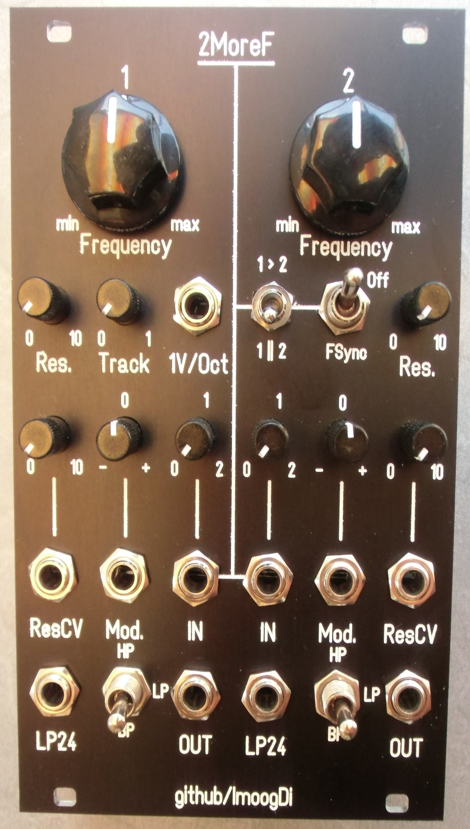
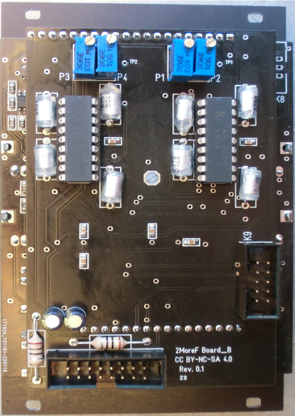

#  2MoreF
> Eurorack Dual Filter using the public CEM3320/AS3320 chip.

**Table of Contents**

- [Introduction](#intro)
- [Construction Guide](./doc/constructionguide.md)
- [Calibration](./doc/calibration.md)
- [Technical data](#technical-data)
- [References](#references)
- [License](#license)

## Introduction

This eurorack-modul is designed for modular-synthesizers as substractive filter.  
The dual-filter is build around two IC's: AS3320, a clone of that old CEM3320.  
All parts are common available and DIY-friendly designed, most parts are SMD's.

- Modul Frontpanel

 
- Modul Backside

 

There are eleven 3.5mm jacks available for patching audio- and CV-signals.  
This descriptions are valid for part (1) {left side} and part (2) {right side} of the dual-filter. 

<table>
<tr>
    <th>Jack-Name</th>
    <th>Function</th>
    <th>Comment</th>
    <th>Detail</th>
</tr>
<tr>
    <td>IN (1)</td>
    <td>audio-input 1</td>
    <td>Level adjustable between 0 ...  2</td>
    <td></td>
</tr>
<tr>
    <td>IN (2)</td>
    <td>audio-input 2</td>
    <td>Level adjustable between 0 ...  2</td>
    <td>Switchable input. Parallel with IN (1) or  serial from OUT (1)  1||2  or  1 > 2</td>
</tr>
<tr>
    <td>ResCV (1)</td>
    <td>CV-input 1 for resonance control</td>
    <td>Level adjustable between 0 ... 10 positiv and negative voltages are supported</td>
    <td></td>
</tr>
<tr>
    <td>ResCV (2)</td>
    <td>CV-input 2 for resonance control</td>
    <td>Level adjustable between 0 ... 10 positiv and negative voltages are supported</td>
    <td>ResCV Input 2 is normalised to ResCV (1)</td>
</tr>
<tr>
    <td>Mod. (1)</td>
    <td>CV-input 1 for modulation control</td>
    <td>Level adjustable between:  -  0  +</td>
    <td></td>
</tr>
<tr>
    <td>Mod. (2)</td>
    <td>CV-input 2 for modulation control</td>
    <td>Level adjustable between:  -  0  +</td>
    <td>Mod. Input 2 is normalised to Mod. (1)</td>
</tr>
<tr>
    <td>OUT (1)</td>
    <td>audio-output 1 for HP/LP/BP mode (12dB/octave)</td>
    <td>audio-output 1 attached to switch (1)  HP := High pass mode  LP := Low pass mode  BP := Band pass mode</td>
    <td>OUT (1) is normalised to OUT (2)</td>
</tr>
<tr>
    <td>OUT (2)</td>
    <td>audio-output 2 for HP/LP/BP mode (12dB/octave)</td>
    <td>audio-output 2 attached to switch (2)  HP := High pass mode  LP := Low pass mode  BP := Band pass mode</td>
    <td>summed OUT (2) and OUT (1), if no patch-cabel is plugged into OUT (1)</td>
</tr>
<tr>
    <td>LP24 (1)</td>
    <td>audio-output 1 for LP mode only (24dB/octave)</td>
    <td>Low pass only audio-output with 24dB/octave (simultaneously usable with 'OUT (1)')</td>
    <td>LP24 (1) is normalised to LP24 (2)</td>
</tr>
<tr>
    <td>LP24 (2)</td>
    <td>audio-output 2 for LP mode only (24dB/octave)</td>
    <td>Low pass only audio-output with 24dB/octave (simultaneously usable with 'OUT (2)')</td>
    <td>summed LP24 (2) and LP24 (1), if no patch-cabel is plugged into LP24 (1)</td>
</tr>
<tr>
    <td>1V/Oct.</td>
    <td>CV-input for 1Voltage/Octave frequency-control</td>
    <td>Both filter-parts (1 and 2) are controlled with this voltage</td>
    <td>The Track-poti can reduce the CV-input voltage This CV-input is normalised to Eurorack-Bus pitch-CV if no patch-cable is plugged into the jack</td>
</tr>
</table>
 
There are eleven potentiometers with following functions:  

<table>
<tr>
    <th>Poti-Name</th>
    <th>Function</th>
    <th>Comment</th>
    <th>Detail</th>
</tr>
<tr>
    <td>Frequency (1)</td>
    <td>Cut-Off frequency 20Hz to 20kHz</td>
    <td>Filter cutoff frequency 1 for part 1 (left filter) range: min := &#60; 20 Hz max := > 20kHz 12 o'clock position := 440Hz</td>
    <td></td>
</tr>
<tr>
    <td>Frequency (2)</td>
    <td>Cut-Off frequency 20Hz to 20kHz</td>
    <td>Filter cutoff frequency 2 for part 2 (right filter) range: min := &#60; 20 Hz max := > 20kHz 12 o'clock position := 440Hz</td>
    <td>Switchable to slave-mode locked to Frequency (1) FSync := Slavemode On, else Off</td>
</tr>
<tr>
    <td>Track</td>
    <td>Keyboard-CV tracking potentiom.</td>
    <td>Keyboard-CV tracking adjustable 0 := None 1 := 1V/octave</td>
    <td>This CV-voltage is assigned to both parts of the dual-filter</td>
</tr>
<tr>
    <td>Res. (1)</td>
    <td>Resonance potentiometer 1</td>
    <td>Resonance adjustment for part 1 (left filter) 0 := None 10 := maximum, self oscillation 12 o'clock position := starting oscillation</td>
    <td></td>
<tr>
    <td>Res. (2)</td>
    <td>Resonance potentiometer 2</td>
    <td>Resonance adjustment for part 2 (right filter) 0 := None 10 := maximum, self oscillation 12 o'clock position := starting oscillation</td>
    <td></td>
</tr>
<tr>
    <td>IN (1)</td>
    <td>Audio input-level attenuator 1</td>
    <td>Level adjustable between 0 ... 2 for part 1 (left filter) 0 := No audio signal from IN-jack 1 := IN-level amplified 0dB 2 := IN-level amplified 6dB</td>
    <td></td>
</tr>
<tr>
    <td>IN (2)</td>
    <td>Audio input-level attenuator 2</td>
    <td>Level adjustable between 0 ... 2 for part 2 (right filter) 0 := No audio signal from IN-jack 1 := IN-level amplified 0dB 2 := IN-level amplified 6dB</td>
    <td></td>
</tr>
<tr>
    <td>ResCV (1)</td>
    <td>Resonance-CV attenuator 1</td>
    <td>Resonance-CV attenuator for part 1 (left filter) 0 := None 10 := maximum</td>
    <td></td>
</tr>
<tr>
    <td>ResCV (2)</td>
    <td>Resonance-CV attenuator 2</td>
    <td>Resonance-CV attenuator for part 2 (right filter) 0 := None 10 := maximum</td>
    <td></td>
</tr>
<tr>
    <td>Mod. (1)</td>
    <td>Modulation-CV attenuverter 1</td>
    <td>Modulation-CV attenuverter 1 for part 1 (left filter) controlling the amount and polarity of modulation - := negative modulation + := positive modulation 0 := no modulation</td>
    <td></td>
</tr>
<tr>
    <td>Mod. (2)</td>
    <td>Modulation-CV attenuverter 2</td>
    <td>Modulation-CV attenuverter 2 for part 2 (right filter) controlling the amount and polarity of modulation - := negative modulation + := positive modulation 0 := no modulation</td>
    <td></td>
</tr>
</table>
 

There are four switches to control the behaviour of signals.  

<table>
<tr>
    <th>Switch</th>
    <th>Function</th>
    <th>Comment</th>
</tr>
<tr>
    <td>HP/LP/BP (1)</td>
    <td>switch (1) attached to OUT (1)  HP := High pass mode  LP := Low pass mode  BP := Band pass mode</td>
    <td></td>
</tr>
<tr>
    <td>HP/LP/BP (2)</td>
    <td>switch (2) attached to OUT (2)  HP := High pass mode  LP := Low pass mode  BP := Band pass mode</td>
    <td></td>
</tr>
<tr>
    <td>1||2 or 1>2</td>
    <td>switch is controlling the input-signal on IN (2)  1||2 := parallel mode: IN (2) get the signal from IN (1)  1>2 := serial mode: IN (2) get the signal from OUT (1) left filter OUTput</td>
    <td>Only available in normalised mode (no patch-cable on IN (2)).</td>
</tr>
<tr>
    <td>FSync or Off</td>
    <td>switch to control the frequency-cutoff on the right filter  FSync := Slave-mode on the right filter (2). The left frequency-cutoff (1) is the master-control and the right frequency-cutoff (2) controls the offset on the right filter Off := Normal-mode for frequency-cutoff (2) on the right filter</td>
    <td></td>
</tr>
</table>
 

## Technical data

- size:  
  width: 16HP  
  depth: 45mm

- power:  
    5Volt, 0 mA  
  +12Volt, 50mA  
  -12Volt, 50mA  

- frequency range: 20Hz to 20kHz.
- frequency CV scale: 1V/Oct, adjustable with poti: 'Track'.
- cutoff-frequency 2 (right filter) switchable to slave-mode to be controlled by cutoff-frequency 1.
- signal input, AC-coupled signal path, level adjustable with potis: 'IN(1)' & 'IN(2)'.
- signal input 2 (right filter) switchable to modes: 'parallel' input 1 or 'serial' OUTput1.
- modulation inputs, DC-coupled signal path, amount adjustable with potis: 'Mod.(1)' & 'Mod.(2)'.
- resonance inputs, DC-coupled signal path, amount adjustable with potis: 'ResCV(1)' & 'ResCV(2)'.
- signal input impedance: > 50kOhm.
- signal output impedance: 470 Ohm.
- CV-Input impedance: 100kOhm.
- expandable with second '2MoreF'filter to get four filters in parallel.

## References

* [electric druid, Multimode filters Part2](https://electricdruid.net/multimode-filters-part-2-pole-mixing-filters/)
* [AN701 Designing Voltage Controlled Filters](http://www.soundsemiconductor.com/downloads/AN701.pdf)

## License
> Hardware:cc by-nc-sa 4.0  ([details](https://creativecommons.org/licenses/by-nc-sa/4.0/))

