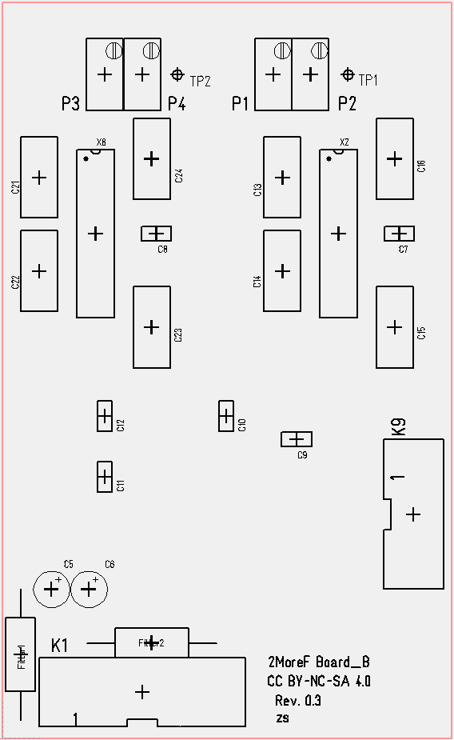

#  2MoreF
> Calibration of CEM/AS3320 dual analog filter eurorack-modul.

## Preconditions
 Required or recommended tools are:

- 440Hz tone-reference (tuning-fork, fork oscillator etc.).
- Voltage meter.
- Frequency meter (if available).
- Eurorack for power (+12V/-12V) and keyboard-CV.
- 16pin Eurorack cable for modul-connection to the rack-bus.
- patchcables for modular synthesizers.

## Calibration

**Table of Contents**

- [Offset-Adjustment](#offset_adjustment)
- [1V/Oct.-Adjustment](#1V_oct_adjustment)
- [Final check](#final_check)
- [License](#license)

> Board_B silk topside  
  

### Offset-Adjustment for left(1) and right(2) side
Offset-adjustment is done with precision trimmers 'P1' and 'P3' on board B.  
 All following setups are done with Modul topside-potis at left and right side.  

>- Set **'Frequency'**-potentiometers 'P4'(1) and 'P9'(2) to 12 o'clock position.  
>- Set **'Res.'** (resonance)-potentiometers to value:10 (**'CW'**, self oscillation).  
>- Set **'Mod'** (modulation)-potentiometers to 12 o'clock position (0 := no modulation).  
>- Set **all other** potentiometers to **CCW** position.  
>- connect 16pin eurorack cable from rack-bus to the socket K1 Pin1 on board B. Be **carefull** to fit the allignment of buspower Pin1 (-12V) .  
>- connect patchcables between signal-output **'OUT(1)' ot 'OUT(2)'** and audio-out (or frequency meter, if available).  
>- power up the eurorack.  
>- Turn precision trimmer **'P1' | 'P3' on 2MoreF board B** until the soundable- or measured- frequency is close as possible to 440Hz.

### 1V/Oct.-Adjustment for left(1) and right(2) side
 The CV-range (1V/octave) must be tuned with potentiometer 'P2' | 'P4' on board B after the offset-adjustment .  
 The **'Res.'** (resonance)-potentiometer must be set to value:10 (**'CW'**, self oscillation).  
 The following setups are done with Modul topside-potis and generating CV-voltages.  

>- Set the keyboard-CV for playing key-note **A4**.  
>- Set **'Track'**-potentiometer to full **CW**.  
>- Turn **'Frequency'**-potentiometers **CCW** until the soundable- or measured- frequency is again 440Hz.  
>- play key-note **A3** and check the measured frequency. If the measurement is above 220Hz, then turn 'P2' | 'P4'-potentiometer **'CCW'**, else **'CW'**.  
>- play key-note **A5** and check the measured frequency. If the measurement is above 880Hz, then turn 'P2' | 'P4' -potentiometer **'CCW'**, else **'CW'**.

 Repeat this adjustments until the measuared frequencies are A2=110Hz, A3=220Hz, A4=440Hz and A5=880Hz.  
 Repeat also the 'offset-adjustment to fit the 440Hz to 12 o'clock position on **'Frequency'**-potentiometers.  

### Final check
 Voltage measurements on Testpoint: TP1 and TP2.  

 The **'Res.'** (resonance)-potentiometers must be set to value:10 (**'CW'**, self oscillation).  
 Set **all other** potentiometers to **CCW** position.  
 >- connect voltage-meter between GND and TP1 or TP2.  

 The following table shows the measured voltages depending on the **'Frequency'**-potentiometer position.  

Poti-position | Frequency (Hz)       | measured voltage on TP1 or TP2 (mVolt)
--------------|----------------------|-----------------------------------
 min (CCW)    | less then 20 Hz      | 175 mVolt
 12 o'clock   | 440 Hz               |  84 mVolt
 max (CW)     | above 20 kHz         | -47 mVolt

## License
> Hardware:cc by-nc-sa 4.0

